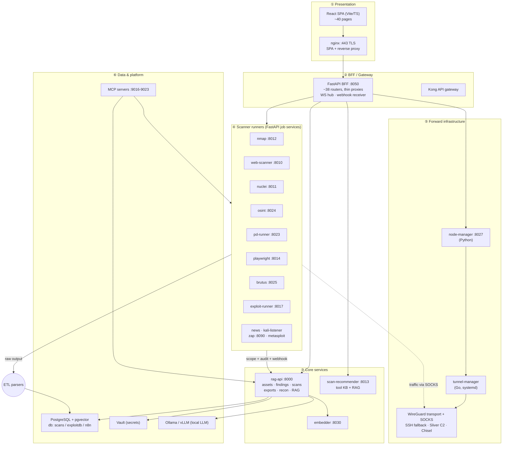
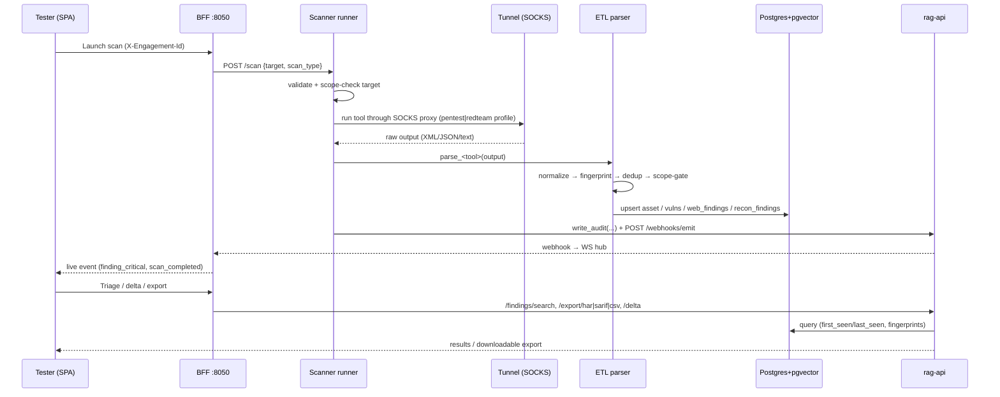

# RAG Scan Stack — Architecture Overview

> A workflow collector for **authorized** penetration testing and red-team engagements. It runs
> security tools, normalizes their wildly different outputs into one engagement-scoped finding
> model, deduplicates and tracks findings across runs, manages forward scanning infrastructure,
> and hands the results straight into manual testing tools (Burp, ZAP) and reports.

This document explains **how the system is built** — the layers, the services, the data model, the
data flow, and the cross-cutting concerns (scoping, audit, webhooks, TLS, deployment). It is the
canonical "everything" map; deep dives live in the linked docs.

- **Companion docs:** [`DATABASE_SCHEMA.md`](DATABASE_SCHEMA.md) · [`API_ENDPOINTS.md`](API_ENDPOINTS.md) · [`RAG_STACK_API_REFERENCE.md`](RAG_STACK_API_REFERENCE.md) · [`DEPLOYMENT.md`](DEPLOYMENT.md) · [`HEALTH_CHECK_GUIDE.md`](HEALTH_CHECK_GUIDE.md) · [`REMOTE-DB-SETUP.md`](REMOTE-DB-SETUP.md)
- **Build version at time of writing:** `2026.06.22-03`

---

## 1. The core idea

A tester juggling 30+ CLI tools loses hours wrangling incompatible output. This stack collapses
that into one pipeline:

```
  Collect ──▶ Normalize ──▶ Store ──▶ Triage ──▶ Hand off
  (30+ tools) (38 parsers)  (Postgres  (rules +   (Burp / HAR /
              fingerprint    +pgvector) delta)     SARIF / CSV / JSON)
              dedup +
              scope-gate
```

It is a **collection and workflow tool, not an attack platform** — its job is to organize the
evidence so a human can test faster, with engagement scope, audit trails, and OPSEC alerts making
authorized-only operation the path of least resistance.

---

## 2. Layered architecture

The system is a **microservice stack** — **45 services** defined in `docker-compose.yml`, all on one
Docker network (`agents_net`); several are one-shot init containers (`vault-init`, `ollama-init`,
`wait-for-db`). It is fundamentally a **tiered API interface**: every layer talks to the next over
HTTP. For this overview the services are grouped into the six layers below — that grouping is a
descriptive lens for explanation, not a label that appears in the code. Everything is
engagement-scoped and audited.

**How many of these do you actually need?** Most are optional capabilities, gated by Compose
`profiles`. The real footprint:

| Tier | Containers | What runs |
|---|---|---|
| Irreducible core | **3** (+1 init) | `rag-postgres`, `rag-api`, `pentest-dashboard` (+ `wait-for-db`) |
| Practical pentest minimum | **~7–8** | core + `nmap_scanner`, `web-scanner`, `nuclei-runner`, `embedder` |
| Default `make up` | **~33** | `COMPOSE_PROFILES=local-db` — core + all scanners, MCP servers, AI agents, C2/exploitation, gateway |
| Everything | **45** | + `vault`, `gpu` (vllm / ollama-gpu / embedder-gpu), and `optional` profiles |

The default is **not** the full 45 — the `vault`, `gpu`, and `optional` profiles are off unless
enabled. The ~25 default-on-but-optional containers (5 MCP servers, `autogen-agents`,
`scan-recommender`, `metasploit`, `sliver-server`, `chisel-server`, exploitation/recon runners, `kong`,
`zap`, …) are capabilities, not requirements. *Note: trimming to the bare 3 requires editing
`pentest-dashboard`'s `depends_on`, which currently waits on `nmap_scanner`, `web-scanner`,
`nuclei-runner`, and `autogen-agents`.*

> The diagrams in this document are a **conceptual view** — they show how the services relate, not a
> traced call graph of every edge.



**Tier responsibilities**

| Tier | What it owns |
|---|---|
| ① Presentation | The React SPA and the nginx TLS terminator that serves it and reverse-proxies the API/WebSocket. |
| ② BFF / Gateway | A thin FastAPI backend-for-frontend that fans out to every downstream service, aggregates health, and pushes live events to the browser over WebSocket. Kong optionally fronts external API access. |
| ③ Core services | `rag-api` (the system of record for assets/findings/scans/exports/recon/RAG), the scan recommender, and the embedding microservice. |
| ④ Scanner runners | One FastAPI service per tool family; each executes the tool, parses output through the ETL layer, and dual-emits audit + webhook events. |
| ⑤ Forward infrastructure | Connects each scan node over WireGuard (SSH fallback), exposes a per-node SOCKS proxy over the tunnel, and manages C2 (Sliver/Chisel) so scanner traffic routes through remote nodes with IP rotation. |
| ⑥ Data & platform | Postgres+pgvector (system of record + RAG index), Vault (secrets), Ollama/vLLM (local LLM), and the MCP servers that expose stack capabilities to LLM clients. |

---

## 3. Service topology & ports

All inter-service traffic is HTTPS on the internal `agents_net` network (self-signed certs;
callers use `verify=False`). Only a handful of ports are published to the host.

**Published to host (representative):**

| Host port | Service | Purpose |
|---|---|---|
| `3002 → 443` | pentest-dashboard (nginx) | **Main UI (HTTPS)** |
| `3001 → 80` | pentest-dashboard (nginx) | HTTP → HTTPS redirect |
| `3000 → 8080` | open-webui | Optional LLM chat UI |
| `8002 / 7080 / 8100` | kong / swagger | API gateway + API docs |
| `9016–9023` | mcp-* servers | MCP (streamable-HTTP) for LLM clients |
| `11435 → 11434` | ollama | Local LLM runtime |
| `55553 / 4444` | metasploit | MSF RPC / C2 listener |
| `31337` | sliver-server | Sliver C2 (HTTPS + gRPC mux) |
| `10443` | chisel-server | Chisel tunnel listener |

**Internal-only service ports** (from `dashboard/bff/config.py`):

| Service | Port | Service | Port |
|---|---|---|---|
| rag-api | 8000 | web-scanner | 8010 |
| nuclei-runner | 8011 | nmap_scanner | 8012 |
| scan-recommender | 8013 | playwright-scanner | 8014 |
| autogen-agents | 8015 | exploit-runner | 8017 |
| container-logs | 8018 | kali-listener | 8019 |
| pd-runner | 8023 | osint-runner | 8024 |
| brutus-runner | 8025 | node-manager / tunnel-manager | 8027 |
| embedder | 8030 | zap | 8090 |
| ollama | 11434 | postgres | 5432 |

Compose entry points: `docker-compose.yml` (main, 45 services; ~33 up by default) plus overlays for macOS
(`docker-compose.mac.yml`), remote DB (`docker-compose.remote-db.yml`), VPN/WireGuard
(`docker-compose.vpn.yml`), Azure, and logging.

---

## 4. End-to-end data flow



Key guarantees along this path:

- **Scope gate is fail-closed.** A discovered host that is not confirmed in-scope is still recorded
  (as an asset + recon finding) but is **never stamped with an `engagement_id`**, so agents never
  scan it (`etl/scope_gate.py`, mirrored in `app/rag-api/scope_classifier.py`).
- **Every action is audited and emitted.** Scanner runners call `write_audit(...)` (engagement-scoped
  contextvar) and `emit_webhook_event(...)` → `POST /webhooks/emit`, so the OPSEC timeline and any
  Slack/n8n/SIEM subscriber see the same events.
- **Fingerprinting dedups across tools/runs** before storage, so the same vuln found by nmap and
  nuclei collapses to one finding with `first_seen`/`last_seen`.

---

## 5. Component deep-dives

### 5.1 Dashboard — `dashboard/`

Two processes in one container, supervised by `supervisord`, TLS-terminated by nginx.

**Frontend (`dashboard/frontend/`)** — React 18 + TypeScript, built with Vite 6, styled with
Tailwind 3.
- **Routing:** `src/App.tsx` — `BrowserRouter`, lazy-loaded routes under a shared `<AppShell>`, plus
  three standalone "popout" routes (chat/users/recon).
- **~40 pages** (`src/pages/*`): Dashboard, ScanLauncher, ScanMonitor, ScanDetail, FindingsExplorer,
  AssetBrowser, DeltaCompare, FollowUps, Recommendations, AttackMap, TargetBoard, Engagements,
  ScopeIntelligence, OpSec, Reports, Nodes, CloudPosture, KnowledgeBase, ExploitManager,
  ReconExplorer, PipelineMonitor, Services, Diagnostics, Settings, ApiTester, and more.
- **Data/state:** `@tanstack/react-query` for server state; `zustand` for UI state (the selected
  engagement is persisted to `localStorage` and auto-attached as the `X-Engagement-Id` header by
  `src/api/client.ts` → `apiFetch()` against base `/api`). Live updates via a `/ws` WebSocket hook.
- **Charts/graphs:** `recharts` + `reactflow` (Attack Map).

**BFF (`dashboard/bff/`)** — FastAPI on port **8050** (uvicorn), started with a background poll loop
and recon agent (`main.py` lifespan). The recon agent's cycle, the
`scan_recommendations` queue it drains, its budgets and a "queue never drains"
runbook are documented in [RECON_AGENT.md](RECON_AGENT.md).

> The BFF is **baked into the `pentest-dashboard` image**, not bind-mounted —
> `docker compose restart` runs the old code. Rebuild after editing
> `dashboard/bff/**`.
- **~38 routers (`routers/*`)** are mostly **thin async proxies** (`httpx.AsyncClient(verify=False)`)
  to downstream services, attaching `x-api-key` + engagement headers. Examples: `scans`, `findings`,
  `assets`, `reports`, `exploits`, `rag` → rag-api; `nodes`/`node_maintenance` → node/tunnel-manager;
  `health` aggregates every service's health.
- **Auth model:** no inbound user auth on the BFF itself (it sits behind nginx on the internal
  network); auth is **outbound** (api-key to rag-api). `engagement.py` middleware captures the inbound
  `X-Engagement-Id` into a request-scoped contextvar for tenant isolation.
- **Live events:** `webhook_receiver.py` (`POST /api/webhooks/receive`) accepts events and broadcasts
  them to WebSocket clients via `ws_hub.py`, re-emitting `finding_critical` for high/critical severity.

**nginx (`dashboard/nginx.conf`)** — port 443 (TLS 1.2/1.3, HSTS), serves the SPA from
`/app/frontend/dist`, reverse-proxies `/api/`, `/ws`, and `/sarif-export` to the BFF at
`127.0.0.1:8050`; port 80 redirects to HTTPS.

### 5.2 Core API — `app/rag-api/`

The **system of record**. FastAPI (`api.py`, a large monolith — ~358 route decorators — with
modular `health_router.py`, `metrics_router.py`, and `webhooks/router.py`).
- **Endpoint groups:** assets (`/assets`, `/software/*`), findings (`/findings/search`,
  `/findings/note`, `/findings/bulk`), scans/tasks (`/scans/{id}`, `/tasks/{id}`), recon
  (`/recon/*`, `/ingest/recon`), RAG/exploits (`/rag/search/enhanced`, `/rag/status`), and exports
  (see §7).
- **Postgres access:** `psycopg2` via a lazy `ThreadedConnectionPool`; DSN pulled from the `DB_DSN`
  secret.
- **Embeddings:** delegated to the external **embedder** microservice (`_embed_texts()` POSTs to
  `EMBEDDER_URL/embed`); vectors are stored in `embedding` columns and feed the **scope-classification
  / feedback learning loop**. Exploit and findings retrieval is largely SQL `ILIKE`/filter-based;
  pgvector is used for the learning loop rather than for exploit lookup.
- **LLM:** generation calls go to Ollama (`ollama:11434`).
- **Adjacent agent modules** in the same dir: `rule_engine.py` (Follow-Up detection rules),
  `scope_classifier.py`, `attack_vectors.py`, `cloud_suggestor.py`/`cloud_triage_agent.py`,
  `takeover_hunter.py`, `osint_agent.py`, `gap_agent.py`, `vault_client.py`.

### 5.3 ETL / normalization — `etl/`

The layer that turns 38 tool formats into one model.
- **No base class or registry** — parsers are **convention-based** standalone modules
  `etl/parse_<tool>.py`, each exposing a top-level `parse_<tool>(path, ...)`. The one dispatch table
  is the generic fallback `_TOOL_PARSERS` in `parse_tool_output.py` (ssh-audit/sslscan/testssl/sslyze),
  used before generic JSON/regex extraction so unknown tools still yield structured findings.
- **38 parsers**, e.g. `parse_nmap`, `parse_nuclei`, `parse_nessus`, `parse_zap`, `parse_burp`,
  `parse_subfinder`, `parse_httpx`, `parse_prowler`, `parse_azurehound`, `parse_microburst`.
- **Normalization flow:** read tool JSON/XML/stdout → upsert asset (`asset_utils.py`,
  `identity_upsert.py`) → route into typed tables (`vulns`, `web_findings`, `recon_findings`);
  `parse_tool_output.py` regex-extracts CVEs/IPs/ports/URLs/severity for unstructured output.
- **Fingerprinting (`etl/fingerprint.py`)** — stable **MD5** with three strategies so the same issue
  from different tools collapses to one finding:
  - `vuln_fingerprint`: `cve|<cve>|ip|port` when a CVE is present, else `script|<normalized>|ip|port`.
  - `web_fingerprint`: `web|url|name|issue_type` (**source excluded** so ZAP == Nuclei on the same URL).
  - `recon_fingerprint`: `recon|source|type|target|data_key` (recon findings are source-specific).
- **Scope-gate (`etl/scope_gate.py`)** — `load_engagement_scope()` reads `scope_targets`;
  `is_in_scope()` matches ip/cidr/domain/url (fnmatch + `ipaddress`), **fails closed**.

### 5.4 Data model — PostgreSQL + pgvector

One Postgres instance (`rag-postgres:5432`) hosting three logical databases: **`scans`** (the app),
**`exploitdb`** (searchsploit/ExploitDB ETL), and **`n8n`** (automation). Schema lives in `db_init/`.
- **Init:** on a fresh volume, Postgres runs everything in `db_init/` alphabetically —
  `create_agent_tables.sql`, `create_exploits.sh`, `ensure_all_tables.sql`, `setup_alldb.sql`.
- **Migrations:** idempotent `ensure_all_tables.sql` (`IF NOT EXISTS`) + focused scripts
  (`add_engagement_id_to_scan_tables.sql`, `add_remote_nodes.sql`, `grpo_migration.sql`); applied by
  `scripts/ensure_db_schema.sh` / `make db-schema`.
- **~100 distinct tables** across all `db_init/` scripts (`setup_alldb.sql` alone defines ~38; the rest
  come from `ensure_all_tables.sql`, `create_agent_tables.sql`, and the focused migrations). The
  grouping below is **representative, not exhaustive** — the categories are a reading aid, not a schema
  namespace:

| Group | Representative tables |
|---|---|
| Inventory | `assets`, `ports`, `port_observation`, `scan_targets` |
| Scans / jobs | `scans`, `jobs`, `tasks`, `raw_output` |
| Findings | `findings`, `vulns`, `web_findings`, `recon_findings`, `finding_evidence`, `credential_findings` |
| Browser | `playwright_scans`, `playwright_findings`, `playwright_screenshots`, `dom_analysis` |
| Engagement / scope | `engagements`, `scope_targets`, `scope_decisions`, `scope_classification_rules`, `scope_suggestions`, `scope_coverage` |
| Infrastructure / nodes | `remote_nodes`, `node_ip_history`, `node_scan_jobs`, `sync_nodes` |
| Intelligence | `scan_recommendations`, `cve`, `rag_documents` |
| Exploits | `edb_exploits`, `edb_raw_files`, `exploit_results`, `pending_exploits`, `msf_modules` |
| Agents | `agent_sessions`, `agent_messages`, `llm_request_metrics`, `session_scan_metrics` |
| Integrations | `zap_sessions`, `webhooks`, `webhook_events`, `webhook_deliveries` |

pgvector `embedding` columns (with ivfflat indexes) live on scope-decision and RAG/feedback tables.
The database name is fixed to `scans`. Full reference: [`DATABASE_SCHEMA.md`](DATABASE_SCHEMA.md).

### 5.5 Scanner runners

Each tool family is its own FastAPI service that follows one **shared pattern**:
1. `@app.post` job endpoint(s) + `/health`.
2. Execute the external tool asynchronously (`subprocess.Popen`), routed through the SOCKS proxy for
   the active profile (pentest | redteam).
3. Parse the output via the `etl/` layer.
4. **Dual-emit:** `write_audit(...)` (engagement-scoped) **and** `emit_webhook_event(...)` →
   `POST /webhooks/emit`.
5. `validation.py` sanitizes inputs; `log_manager.py` handles logging.

Entry points: `nmap_scanner/nmap-api.py`, `web_scanner/web_scan.py`, `nuclei/nuclei_runner.py`,
`osint_runner/osint_runner.py`, `pd_runner/pd_runner.py`, `brutus_runner/brutus_runner.py`,
`exploit_runner/exploit_runner.py`, `kali_listener/listener_service.py`, `news_runner/main.py`,
`playwright_scanner/playwright_scanner.py`. Distinctive cases: **playwright_scanner** is the richest
(DOM/content/metadata/param analyzers, screenshots, ZAP bridge, wordlist gen); **exploit_runner**
bundles Metasploit (`msf_client.py`) + web PoC/payload generators; **osint_runner** and **pd_runner**
ship vendored Go binaries; **news_runner** is a lightweight LLM news agent.

### 5.6 Forward infrastructure — `node_manager/` + `tunnel-manager/`

Routes scanner traffic through remote nodes for IP rotation and OPSEC separation. **WireGuard is
the current transport** each node connects over; a **per-node SOCKS proxy rides on top of the tunnel**
so scanners route egress through the node. **SSH tunnels remain as a fallback.** A node carries a
`tunnel_method` of `wireguard` or `ssh`, and the node-manager watchdog auto-reconnects either type
(dedicated WireGuard reconnect path, re-exposing the node's SOCKS port ~1080).
- **`node_manager/` (Python/FastAPI, port 8027)** — manages remote scan nodes, allocates a unique
  SOCKS proxy port per node, and stands up the tunnel by `tunnel_method` (`ssh_manager.py` with
  socat forwarding to a node-side dante SOCKS server; `WGTunnel`/`SSHTunnel`), plus Sliver C2 (`sliver_client.py`) and Active Directory
  execution (`ad_executor.py`). *Note: provisioning here is WireGuard/Sliver/Chisel-centric; cloud
  droplets are referenced but no direct DigitalOcean/AWS SDK calls appear in this module.*
- **`tunnel-manager/` (Go, systemd service)** — owns tunnel lifecycle and port allocation:
  `port_allocator.go` reserves SSH (10120–10149) and WireGuard (10150–10199) ranges;
  `wireguard_manager.go` manages peers on `10.66.0.0/24` (server port 51820); `api.go` exposes the
  HTTP control API. *Note: the "pentest vs redteam" separation is driven by port-range / proxy config
  rather than named profile strings in the Go source.*

### 5.7 Optional LLM / RAG agents

Off by default; run against **local** models so engagement data never leaves the host.
- **`scan_recommender/` (FastAPI, 8013)** — recommends the right tool + command per service/port from
  a static tool KB (`tool_kb.py`) plus a **pgvector RAG** over `exploit_chunks` (`exploits_rag.py`,
  ivfflat/`vector_l2_ops`), embeddings via `nomic-embed-text` (Ollama). `/rag/ask` + `/rag/feedback`
  form a feedback loop logged to `rag_query_log` / `rag_feedback` (migrations in
  `scan_recommender/migrations/`). Default gen model: `mistral:latest`; `LLM_BACKEND` selects
  Ollama/vLLM.
- **`autogen_agents/` (8015)** — the AI agent service. The directory and container keep the
  `autogen` name for continuity (compose, the cert SAN and the BFF's `autogen_url` all reference
  it), but the orchestration is **LangGraph**, not AutoGen — see
  Docs/LANGGRAPH_MIGRATION_PLAN.md.
  - **`langgraph_engine.py`** — a `StateGraph` per session, one durable run per
    `thread_id = session_id`. Deterministic supervisor edges
    (recon → scan → analyze → [exploit] → report) rather than LLM speaker selection, which is
    what removed the GroupChat stall class. recon/scan/analyze are `create_react_agent` LLM
    agents over per-phase toolsets; each has a deterministic fallback so a rate-limited model
    never hard-fails a session.
  - **`tool_registry.py`** — the single source of truth for the 49 tools an LLM may call
    (`name`, LLM-facing `description`, callable). `langgraph_tools.py` wraps them for
    `ToolNode`; `mcp_tools_bridge.NATIVE_TOOL_NAMES` derives from it. Bodies live in
    `scan_tools.py`, so the scope gate and `MAX_CONCURRENT_SCANS` apply identically however a
    tool is called.
  - **Human-in-the-loop** — the opt-in exploit phase queues ONE candidate and then parks on a
    native `interrupt()`; the session sits at `status='awaiting_approval'` with its state in
    Postgres (`checkpoints`, `checkpoint_blobs`, `checkpoint_writes`) until an operator answers
    `POST /pentest/{id}/approve`, which resumes the SAME session with no replay.
  - Also ships the A/B LLM config, MCP tool discovery (`mcp_server.py`/`mcp_tools_bridge.py`),
    a `passive_only` mode and the report generator.
  - **Retired here:** `pyautogen`, `PentestTeam`, the GroupChat + custom speaker selection,
    stall *recovery* and `POST /pentest/{id}/nudge`. Stall *detection* remains.

Every recommendation is a reviewable OPSEC timeline entry; every action is audited.

### 5.8 MCP servers — `mcp/`

FastMCP servers exposing stack capabilities to LLM clients (Claude Desktop, Continue, etc.).
Streamable-HTTP servers (stateless, `/mcp` path) on **9016–9023**: sessions (9016), scanning (9017),
recon (9018), exploit (9019), credentials (9020), pipelines (9021), burp-integration (9022),
zap-integration (9023). Files `mcp-recon.py`, `mcp-scanning.py`, `mcp-exploit.py`, etc. proxy via
`httpx` to backend services. A stdio bridge (`mcp-stdio-server.py`) and an SSE/HTTP variant also
exist; launched by `launch-mcp-servers.sh`.

### 5.9 Supporting platform services

| Service | Role |
|---|---|
| **Vault** + `vault-init` | Secret storage (DSN, API keys, node creds); `vault_client.py` reads them. |
| **Kong** + swagger-ui/specs | Optional external API gateway + published OpenAPI docs. |
| **container-logs** (8018) | Reads Docker logs/health for third-party containers (ZAP, Metasploit) via the Docker SDK; also a co-holder of `db-config.json`. |
| **Ollama / vLLM** | Local LLM runtime for all AI features (11434). `ollama-init` pulls models. |
| **embedder / embedder-gpu** (8030) | Text-embedding microservice for pgvector. |
| **open-webui** | Optional standalone LLM chat UI (host 3000). |
| **n8n** | Optional workflow automation subscribing to webhooks. |
| **zap** (8090), **metasploit** (55553/4444), **sliver-server** (31337), **chisel-server** (10443) | Third-party tooling containers. |
| **wg-server** | WireGuard server for node connectivity. |

---

## 6. Cross-cutting concerns

**Engagement scoping (multi-tenant isolation).** An engagement groups everything; the top-bar
selector sets `X-Engagement-Id`, which the BFF captures into a contextvar and forwards to rag-api,
which filters every query. In-scope IPs are auto-included even if scanned before the engagement
existed. The scope gate ensures out-of-scope hosts are recorded but never scanned.

**Audit + OPSEC timeline.** Every scanner dispatch, node action, and agent decision is written to the
audit trail (engagement-scoped) and surfaced on the OpSec page. Alerts fire on out-of-scope target
attempts, anomalous scan rates, and any agent recommendation that breaches scope.

**Webhooks (mandatory for new actions).** Any feature that performs an action **must** emit via
`POST /webhooks/emit` with a descriptive `event_type` (e.g. `recon_agent_scan_dispatched`,
`pipeline_stage_completed`) and engagement/target/scan context — so Slack, n8n, or a SIEM can
subscribe. The BFF re-broadcasts these to the browser over WebSocket for live UI updates.

**TLS everywhere.** The dashboard is HTTPS (nginx, TLS 1.2/1.3 + HSTS). Internal service-to-service
traffic is HTTPS with self-signed certs (`certs/`, generated by `make setup`). Scanner egress can be
routed through profile-based proxies (pentest | redteam).

**Versioning.** The build version is a `date+timestamp` string kept in sync across **three** places:
`dashboard/frontend/package.json`, `dashboard/frontend/src/lib/constants.ts` (`BUILD_VERSION`, shown
in the TopBar), and `.env` (`BUILD_VERSION`, injected into all containers).

---

## 7. Exports

Deterministic, documented exports so findings flow into manual tools and reports. Implemented in
`app/rag-api/api.py`, surfaced through `dashboard/bff/routers/reports.py`:

| Format | Endpoint | Use |
|---|---|---|
| **HAR** | `/export/har` | Import into Burp Suite / ZAP (with real request/response pairs). |
| **SARIF** (v2.1.0) | `/export/sarif` | AppSec / CI hand-off; results grouped into runs by tool. |
| **Burp XML / sitemap** | `/export/burp`, `export_sitemap_burp_xml` | Populate Burp Target/sitemap. |
| **Proxy replay** | `/export/proxy-replay` | Push URLs/params/payloads through Burp/ZAP. |
| **JSON** | `export_data` (default) | Normalized envelope of selected categories. |
| **CSV** | `export_data` (`format=csv`) | Flattened per-table CSVs zipped together. |
| **Nessus / findings-exchange** | `export_data`, `export_findings_exchange` | Interchange formats. |

In addition, the bundled **Burp extension** (`burp-extension/RagScanBridge.py`, Jython) pulls findings
directly into *Target > Issues*, filtered by scope/engagement/host/severity/tool.

---

## 8. Deployment & configuration

**Database modes** (Settings → Database, persisted in `db-config.json`):

| Mode | Meaning | Required keys |
|---|---|---|
| `local` (default) | Local Postgres container | `mode` only |
| `remote` | Remote Postgres over an SSH tunnel | `remote_db_host`, `remote_db_ssh_user`, `remote_db_ssh_key`, `remote_db_user`, `remote_db_password` |
| `remote_direct` | Remote Postgres over SSL | `remote_db_host`, `remote_db_port`, `remote_db_user`, `remote_db_password` |

> ⚠️ **`db-config.json` must exist as a *file* before `docker compose up`.** If missing, Docker
> creates it as a *directory*, after which reads return empty defaults and writes raise
> `IsADirectoryError` — surfacing as the misleading **"remote_db_host not configured"**. It is
> bind-mounted into both `container-logs` (`/project/db-config.json`) and `pentest-dashboard`
> (`/app/db-config.json`); it is read/written in `dashboard/bff/routers/settings.py` and
> `container_logs.py`, which tolerate both flat and nested `{enabled, mode, config, metadata}` shapes.
> `scripts/setup.sh` seeds it; `scripts/post-install-check.sh` asserts it is a file.

**Compose overlays:** `docker-compose.mac.yml`, `docker-compose.remote-db.yml`,
`docker-compose.vpn.yml`, `docker-compose.azure.yml`, `docker-compose.logging.yml`.

**Lifecycle (Makefile):**

```sh
make setup        # generate secrets, certs, .env, db-config.json (one-time)
make up           # build + start the stack (local Postgres by default)
make db-status    # verify DB health
make db-schema    # apply idempotent migrations
docker compose ps # container health
make down         # stop
make clean        # reset (destroys local DB data)
```

The dashboard comes up at **https://localhost:3002** (self-signed cert on first boot).

**Install / health scripts:** `scripts/setup.sh`, `scripts/post-install-check.sh`,
`scripts/ensure_db_schema.sh`, `generate-credentials.sh`, `update-database-credentials.sh`. Per
project convention, **any new DB element or feature must be retrofitted into these install and
health-check scripts.**

---

## 9. Directory map

| Path | What lives there |
|---|---|
| `dashboard/frontend/` · `dashboard/bff/` | React SPA + FastAPI BFF (nginx-fronted). |
| `app/rag-api/` | Core API — assets, findings, scans, exports, recon, RAG. |
| `app/embedder/` | Embedding microservice. |
| `etl/` | 38 parsers + fingerprinting + scope-gating. |
| `db_init/` | Postgres schema + migrations. |
| `node_manager/` · `tunnel-manager/` | Remote nodes: WireGuard transport + per-node SOCKS proxy, SSH fallback (Python + Go). |
| `nmap_scanner/`, `web_scanner/`, `nuclei/`, `osint_runner/`, `pd_runner/`, `playwright_scanner/`, `brutus_runner/`, `news_runner/`, `exploit_runner/`, `kali_listener/` | Tool-specific scanner runners. |
| `autogen_agents/` · `scan_recommender/` | Optional LLM/RAG agents. |
| `mcp/` · `mcpo/` | MCP servers for LLM clients. |
| `burp-extension/` | Jython extension → Burp Issues. |
| `knowledge/` | Scope rules + playbook content for RAG. |
| `vault/`, `kong/`, `monitoring/`, `container_logs/` | Platform/support services. |
| `scripts/` | Setup, health-check, credential, migration scripts. |
| `Docs/` | This document and all companion docs. |
| `tests/` | Parser + fingerprinting unit tests and fixtures. |

---

## 10. Quality & conventions (how the code is expected to grow)

- **Parsers and fingerprinting have unit tests** (`tests/`) with sample fixtures.
- **New DB elements** → add to `db_init/setup_alldb.sql` *and* `ensure_all_tables.sql`, plus the
  health-check scripts.
- **New actions** → must emit webhook events.
- **Cross-platform changes** → logged in `Docs/OS_CHANGES_FOR_MIGRATION.md`; general changes in
  `Docs/CHANGES_MADE.md`.
- **Version bump** on every change across the three sync'd locations (§6).
- **Authorized use only** — engagement scope, audit trails, and OPSEC alerts are designed so
  authorized-only operation is the path of least resistance.
