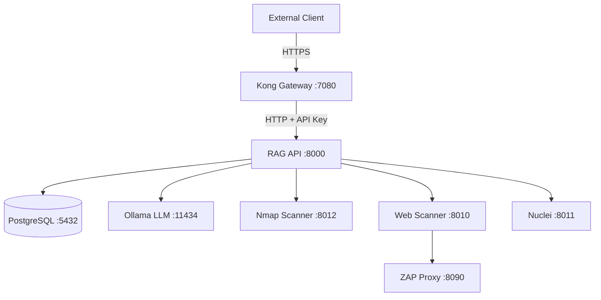

# RAG Scan Stack - Comprehensive Analysis & Improvement Plan

**Analysis Date:** 2024-11-19
**Analyst:** Claude Code
**Stack Version:** Current (as of analysis)

---

## Executive Summary

This document provides a comprehensive security and architecture analysis of the RAG Scan Stack, a multi-service security scanning platform integrating Nmap, Nuclei, ZAP, Playwright, and AI-driven agents. The analysis identified critical security issues, architectural improvements, and operational enhancements across 7 categories.

### Status Overview

| Category | Total Findings | Completed | Remaining |
|----------|----------------|-----------|-----------|
| Critical Security | 1 | ✅ 1 | 0 |
| High Priority Security | 4 | 0 | 4 |
| Medium Priority Security | 3 | 0 | 3 |
| Architecture | 5 | 0 | 5 |
| Performance | 4 | 0 | 4 |
| Operational | 6 | 0 | 6 |
| Documentation | 3 | 1 | 2 |
| **TOTAL** | **26** | **2** | **24** |

---

## CRITICAL FINDINGS (Priority 1)

### ✅ CRITICAL-1: Hardcoded Credentials [COMPLETED]

**Status:** ✅ RESOLVED
**Risk:** Critical - Credential exposure, unauthorized access
**Effort:** Medium (2-4 hours)

**Original Issue:**
- Hardcoded API keys and database passwords throughout codebase
- "changeme" default values in production code
- No centralized credential management
- Credentials scattered across 10+ files

**Resolution Implemented:**
- Created `generate-credentials.sh` for secure credential generation
- Centralized all credentials in `.env` file with 600 permissions
- Created `update-database-credentials.sh` for password rotation
- Created `update-kong-config.sh` for API gateway updates
- Updated database initialization scripts with security warnings
- Created comprehensive `SECURITY_SETUP.md` documentation

**Files Modified:**
- ✅ `/opt/rag-scan-stack/generate-credentials.sh` (created)
- ✅ `/opt/rag-scan-stack/update-database-credentials.sh` (created)
- ✅ `/opt/rag-scan-stack/update-kong-config.sh` (created)
- ✅ `/opt/rag-scan-stack/.env.example` (updated)
- ✅ `/opt/rag-scan-stack/db_init/setup_alldb.sql` (updated)
- ✅ `/opt/rag-scan-stack/SECURITY_SETUP.md` (created)

---

## HIGH PRIORITY SECURITY (Priority 2)

### SECURITY-1: Path Traversal Vulnerability in Nmap Scanner

**Risk:** High - Arbitrary file read/write
**Effort:** Low (1-2 hours)
**Location:** `nmap_scanner/nmap_scan.py`

**Issue:**
```python
# Line ~180-190 - Unsanitized file paths
nmap_out_file = os.path.join(NMAP_OUT_DIR, f"nmap_{scan_id}.xml")
```

User-controlled `scan_id` could contain path traversal sequences like `../../etc/passwd`.

**Recommendation:**
```python
import re

def sanitize_scan_id(scan_id):
    # Allow only alphanumeric, hyphens, and underscores
    if not re.match(r'^[a-zA-Z0-9_-]+$', scan_id):
        raise ValueError("Invalid scan_id format")
    return scan_id

# Usage
scan_id = sanitize_scan_id(scan_id)
nmap_out_file = os.path.join(NMAP_OUT_DIR, f"nmap_{scan_id}.xml")
```

**Files to Modify:**
- `nmap_scanner/nmap_scan.py`
- `web_scanner/web_scan.py`
- `nuclei/nuclei_runner.py`
- `playwright_scanner/playwright_scanner.py`

### SECURITY-2: No HTTPS/TLS for Inter-Service Communication

**Risk:** High - Man-in-the-middle attacks, credential interception
**Effort:** High (8-16 hours)

**Issue:**
All services communicate over HTTP on Docker network:
- `http://rag-api:8000`
- `http://ollama:11434`
- `http://zap:8090`

Credentials and scan data transmitted in plaintext within container network.

**Recommendation:**
1. Generate self-signed certificates for internal services
2. Configure services to use TLS
3. Update all service URLs to HTTPS
4. Implement certificate validation

**Implementation Steps:**
```bash
# 1. Generate certificates
./scripts/generate-internal-certs.sh

# 2. Mount certificates in docker-compose.yml
volumes:
  - ./certs:/etc/certs:ro

# 3. Update service configurations to use HTTPS
# 4. Update Kong to terminate TLS for external access
```

### SECURITY-3: SQL Injection Risk in Database Queries

**Risk:** High - Database compromise
**Effort:** Medium (4-6 hours)
**Location:** Multiple Python services

**Issue:**
Some queries use string formatting instead of parameterized queries:

```python
# VULNERABLE - Do not use
query = f"SELECT * FROM scans WHERE target = '{target}'"
cursor.execute(query)
```

**Recommendation:**
Use parameterized queries everywhere:

```python
# SAFE - Always use this approach
query = "SELECT * FROM scans WHERE target = %s"
cursor.execute(query, (target,))
```

**Files to Audit:**
- `app/rag-api/api.py` (check all DB queries)
- `scan_recommender/*.py`
- `autogen_agents/*.py`
- `etl/edb_ingest_json.py`

### SECURITY-4: No Rate Limiting on API Endpoints

**Risk:** High - DoS, resource exhaustion
**Effort:** Low (2-3 hours)

**Issue:**
No rate limiting configured on any service endpoints. Attackers could:
- Exhaust system resources with scan requests
- Overload database with queries
- Cause service degradation

**Recommendation:**
Configure Kong rate limiting plugin:

```yaml
# kong/kong.yml
plugins:
  - name: rate-limiting
    config:
      minute: 100
      hour: 1000
      policy: local
      fault_tolerant: true

# Per-service limits
services:
  - name: svc-nmap-scanner
    plugins:
      - name: rate-limiting
        config:
          minute: 10  # Max 10 nmap scans per minute
```

---

## MEDIUM PRIORITY SECURITY (Priority 3)

### SECURITY-5: Excessive Docker Container Privileges

**Risk:** Medium - Container escape potential
**Effort:** Low (1 hour)

**Issue:**
Some containers run with unnecessary capabilities:

```yaml
# docker-compose.yml
rag-api:
  cap_add: [NET_RAW, NET_ADMIN]  # May not need both
```

**Recommendation:**
- Audit which services actually need NET_RAW/NET_ADMIN
- Remove unnecessary capabilities
- Add `cap_drop: [ALL]` as default, then add only required caps
- Consider using `security_opt: [no-new-privileges:true]`

### SECURITY-6: No Input Validation on Scan Targets

**Risk:** Medium - SSRF, internal network scanning
**Effort:** Medium (3-4 hours)

**Issue:**
Services accept arbitrary target URLs/IPs without validation:
- Could scan internal Docker network (172.x.x.x)
- Could scan localhost services
- Could scan AWS metadata endpoint (169.254.169.254)

**Recommendation:**
```python
import ipaddress

def validate_scan_target(target):
    """Validate scan target is not internal/private"""
    try:
        ip = ipaddress.ip_address(target)
        if ip.is_private or ip.is_loopback or ip.is_link_local:
            raise ValueError("Cannot scan private/internal IP addresses")
    except ValueError:
        # Not an IP, validate as domain
        if target.endswith('.local') or target == 'localhost':
            raise ValueError("Cannot scan local domains")
    return target
```

### SECURITY-7: Secrets in Docker Logs

**Risk:** Medium - Credential leakage
**Effort:** Low (2 hours)

**Issue:**
Some services log sensitive information:
- API keys in request logs
- Database connection strings
- Error messages with credentials

**Recommendation:**
```python
import logging
import re

class SensitiveDataFilter(logging.Filter):
    def filter(self, record):
        # Redact API keys
        record.msg = re.sub(
            r'(api[_-]?key["\s:=]+)([a-f0-9]{32,})',
            r'\1[REDACTED]',
            str(record.msg),
            flags=re.IGNORECASE
        )
        # Redact passwords
        record.msg = re.sub(
            r'(password["\s:=]+)([^\s&]+)',
            r'\1[REDACTED]',
            str(record.msg),
            flags=re.IGNORECASE
        )
        return True

# Apply to all loggers
for handler in logging.root.handlers:
    handler.addFilter(SensitiveDataFilter())
```

---

## ARCHITECTURE IMPROVEMENTS (Priority 4)

### ARCH-1: No Database Connection Pooling

**Impact:** High - Performance bottleneck
**Effort:** Low (2 hours)

**Issue:**
Each request creates new database connection:
```python
conn = psycopg2.connect(DB_DSN)
# ... use connection ...
conn.close()
```

**Recommendation:**
Use connection pooling:

```python
from psycopg2.pool import ThreadedConnectionPool

# Initialize once at startup
db_pool = ThreadedConnectionPool(
    minconn=5,
    maxconn=20,
    dsn=DB_DSN
)

# Use in requests
def get_db_connection():
    conn = db_pool.getconn()
    try:
        yield conn
    finally:
        db_pool.putconn(conn)
```

### ARCH-2: No Service Health Checks in Application Code

**Impact:** Medium - Poor error handling
**Effort:** Low (2 hours)

**Issue:**
Services don't check dependencies are healthy before operating:
- No check if PostgreSQL is ready
- No check if Ollama is available
- No check if ZAP is running

**Recommendation:**
Implement startup health checks:

```python
import time
import requests

def wait_for_service(url, timeout=60, service_name="Service"):
    """Wait for service to be healthy"""
    start = time.time()
    while time.time() - start < timeout:
        try:
            response = requests.get(url, timeout=5)
            if response.status_code == 200:
                print(f"✓ {service_name} is ready")
                return True
        except Exception:
            pass
        time.sleep(2)
    raise RuntimeError(f"{service_name} not ready after {timeout}s")

# Use at startup
wait_for_service("http://rag-postgres:5432", service_name="PostgreSQL")
wait_for_service("http://ollama:11434/api/tags", service_name="Ollama")
```

### ARCH-3: No Retry Logic for Transient Failures

**Impact:** Medium - Unnecessary failures
**Effort:** Low (2 hours)

**Issue:**
No retry logic for network requests or database operations. Services fail immediately on transient errors.

**Recommendation:**
```python
from tenacity import retry, stop_after_attempt, wait_exponential

@retry(
    stop=stop_after_attempt(3),
    wait=wait_exponential(multiplier=1, min=2, max=10)
)
def call_external_service(url):
    response = requests.get(url)
    response.raise_for_status()
    return response.json()
```

### ARCH-4: No Structured Logging

**Impact:** Medium - Poor observability
**Effort:** Medium (3-4 hours)

**Issue:**
Services use print statements and basic logging:
```python
print(f"Starting scan for {target}")
```

Hard to parse, search, and aggregate logs.

**Recommendation:**
Use structured JSON logging:

```python
import structlog

logger = structlog.get_logger()

logger.info(
    "scan_started",
    scan_id=scan_id,
    target=target,
    scan_type="nmap",
    ports=port_list
)
```

Benefits:
- Easy to parse and search
- Works with log aggregation tools (ELK, Splunk)
- Better debugging and monitoring

### ARCH-5: No Message Queue for Async Operations

**Impact:** Medium - Scalability limitations
**Effort:** High (8-12 hours)

**Issue:**
All scan operations are synchronous HTTP requests. Long-running scans:
- Block HTTP connections
- Risk timeouts
- Can't distribute load across workers

**Recommendation:**
Implement message queue (RabbitMQ or Redis):

```python
# Producer (API)
import pika

connection = pika.BlockingConnection(pika.ConnectionParameters('rabbitmq'))
channel = connection.channel()
channel.queue_declare(queue='scan_queue', durable=True)

# Submit scan job
channel.basic_publish(
    exchange='',
    routing_key='scan_queue',
    body=json.dumps({
        'scan_id': scan_id,
        'target': target,
        'scan_type': 'nmap'
    }),
    properties=pika.BasicProperties(delivery_mode=2)  # Persistent
)

# Consumer (Worker)
def callback(ch, method, properties, body):
    job = json.loads(body)
    perform_scan(job)
    ch.basic_ack(delivery_tag=method.delivery_tag)

channel.basic_consume(queue='scan_queue', on_message_callback=callback)
channel.start_consuming()
```

---

## PERFORMANCE IMPROVEMENTS (Priority 5)

### PERF-1: No Resource Limits on Containers

**Impact:** High - Resource exhaustion
**Effort:** Low (1 hour)

**Issue:**
Containers have no CPU/memory limits:
```yaml
# Missing resource constraints
rag-api:
  image: ...
  # No limits!
```

A single service could consume all host resources.

**Recommendation:**
```yaml
rag-api:
  deploy:
    resources:
      limits:
        cpus: '2.0'
        memory: 2G
      reservations:
        cpus: '0.5'
        memory: 512M

nmap_scanner:
  deploy:
    resources:
      limits:
        cpus: '4.0'      # CPU-intensive scans
        memory: 4G
      reservations:
        cpus: '1.0'
        memory: 1G
```

### PERF-2: No Caching for Embedding Models

**Impact:** Medium - Slow startup, high memory
**Effort:** Low (1 hour)

**Issue:**
Each service downloads/loads embedding models independently:
- `sentence-transformers/all-MiniLM-L6-v2` loaded multiple times
- Models downloaded on every container rebuild

**Recommendation:**
```yaml
volumes:
  model-cache:

services:
  rag-api:
    volumes:
      - model-cache:/root/.cache/huggingface
  scan-recommender:
    volumes:
      - model-cache:/root/.cache/huggingface
```

### PERF-3: Inefficient Vector Similarity Search

**Impact:** Medium - Slow RAG queries
**Effort:** Medium (3-4 hours)

**Issue:**
Vector searches may not use optimal indexing:
```sql
SELECT * FROM embeddings
ORDER BY embedding <-> query_vector
LIMIT 10;
```

**Recommendation:**
Create IVFFlat or HNSW index:

```sql
-- For datasets < 1M vectors
CREATE INDEX ON embeddings
USING ivfflat (embedding vector_cosine_ops)
WITH (lists = 100);

-- For datasets > 1M vectors (faster, more memory)
CREATE INDEX ON embeddings
USING hnsw (embedding vector_cosine_ops);

-- Tune for accuracy vs speed
SET ivfflat.probes = 10;
```

### PERF-4: No Request Batching for Scans

**Impact:** Medium - Inefficient resource use
**Effort:** Medium (4-6 hours)

**Issue:**
Each scan target processed individually. Scanning 100 hosts = 100 separate operations.

**Recommendation:**
Implement batch processing:

```python
@app.post("/api/scan/batch")
async def batch_scan(targets: List[str], scan_type: str):
    """Process multiple targets efficiently"""
    scan_id = str(uuid.uuid4())

    # Store batch job
    batch_job = {
        'scan_id': scan_id,
        'targets': targets,
        'scan_type': scan_type,
        'status': 'queued'
    }

    # Process in background
    asyncio.create_task(process_batch(batch_job))

    return {'batch_id': scan_id, 'target_count': len(targets)}
```

---

## OPERATIONAL IMPROVEMENTS (Priority 6)

### OPS-1: No Backup/Restore Procedures

**Impact:** High - Data loss risk
**Effort:** Medium (4-6 hours)

**Issue:**
No documented backup procedures for:
- PostgreSQL databases
- Scan results
- Configuration files

**Recommendation:**
Create backup scripts:

```bash
#!/bin/bash
# backup-rag-stack.sh

BACKUP_DIR="/backups/rag-stack-$(date +%Y%m%d)"
mkdir -p "$BACKUP_DIR"

# Backup PostgreSQL
docker exec rag-postgres pg_dumpall -U app | gzip > "$BACKUP_DIR/postgres.sql.gz"

# Backup volumes
docker run --rm \
  -v rag-pgdata:/data \
  -v "$BACKUP_DIR":/backup \
  alpine tar czf /backup/pgdata.tar.gz /data

# Backup configuration
cp .env "$BACKUP_DIR/env.backup"
cp -r kong/ "$BACKUP_DIR/kong-config/"

echo "✓ Backup complete: $BACKUP_DIR"
```

### OPS-2: No Monitoring/Alerting

**Impact:** High - Undetected failures
**Effort:** High (8-12 hours)

**Issue:**
No monitoring solution. Can't detect:
- Service failures
- Performance degradation
- Resource exhaustion
- Failed scans

**Recommendation:**
Implement Prometheus + Grafana:

```yaml
# docker-compose.yml additions
prometheus:
  image: prom/prometheus
  volumes:
    - ./prometheus.yml:/etc/prometheus/prometheus.yml
  ports:
    - "9090:9090"

grafana:
  image: grafana/grafana
  ports:
    - "3000:3000"
  environment:
    - GF_SECURITY_ADMIN_PASSWORD=${GRAFANA_PASSWORD}
```

Add metrics to services:
```python
from prometheus_client import Counter, Histogram, start_http_server

scan_counter = Counter('scans_total', 'Total scans', ['scan_type'])
scan_duration = Histogram('scan_duration_seconds', 'Scan duration', ['scan_type'])

@scan_duration.labels(scan_type='nmap').time()
def perform_nmap_scan(target):
    # ... scan logic ...
    scan_counter.labels(scan_type='nmap').inc()
```

### OPS-3: No Log Aggregation

**Impact:** Medium - Hard to debug
**Effort:** Medium (4-6 hours)

**Issue:**
Logs scattered across 16+ containers. Need to check each service individually:
```bash
docker-compose logs rag-api
docker-compose logs nmap_scanner
# ... repeat for each service
```

**Recommendation:**
Add ELK stack or Loki:

```yaml
loki:
  image: grafana/loki
  ports:
    - "3100:3100"

promtail:
  image: grafana/promtail
  volumes:
    - /var/lib/docker/containers:/var/lib/docker/containers:ro
    - ./promtail-config.yml:/etc/promtail/config.yml
```

### OPS-4: No Automated Testing

**Impact:** Medium - Regression risk
**Effort:** High (12-16 hours)

**Issue:**
No automated tests for:
- API endpoints
- Scan functionality
- Database operations
- Integration between services

**Recommendation:**
Add pytest test suite:

```python
# tests/test_api.py
import pytest
import requests

@pytest.fixture
def api_client():
    return requests.Session()

def test_health_endpoint(api_client):
    response = api_client.get('http://localhost:8000/health')
    assert response.status_code == 200
    assert response.json()['status'] == 'healthy'

def test_scan_creation(api_client):
    response = api_client.post(
        'http://localhost:8000/api/scan',
        json={'target': '192.168.1.1', 'scan_type': 'nmap'},
        headers={'x-api-key': API_KEY}
    )
    assert response.status_code == 201
    assert 'scan_id' in response.json()
```

### OPS-5: No CI/CD Pipeline

**Impact:** Medium - Manual deployment errors
**Effort:** Medium (6-8 hours)

**Issue:**
No automated build/test/deploy pipeline. All operations manual.

**Recommendation:**
Create GitHub Actions workflow:

```yaml
# .github/workflows/ci.yml
name: CI/CD Pipeline

on: [push, pull_request]

jobs:
  test:
    runs-on: ubuntu-latest
    steps:
      - uses: actions/checkout@v2
      - name: Build containers
        run: docker-compose build
      - name: Run tests
        run: docker-compose run --rm rag-api pytest

  security-scan:
    runs-on: ubuntu-latest
    steps:
      - uses: actions/checkout@v2
      - name: Run Trivy security scan
        uses: aquasecurity/trivy-action@master
        with:
          scan-type: 'fs'
          scan-ref: '.'
```

### OPS-6: No Disaster Recovery Plan

**Impact:** High - Business continuity risk
**Effort:** Medium (4-6 hours)

**Issue:**
No documented recovery procedures for:
- Complete system failure
- Data corruption
- Service compromise

**Recommendation:**
Create disaster recovery documentation:
- Recovery Time Objective (RTO): How long to restore
- Recovery Point Objective (RPO): Acceptable data loss
- Step-by-step recovery procedures
- Contact information and escalation paths

---

## DOCUMENTATION IMPROVEMENTS (Priority 7)

### DOC-1: No API Documentation

**Status:** Partial - Swagger UI exists but incomplete
**Effort:** Medium (4-6 hours)

**Issue:**
- Swagger docs missing request/response examples
- No authentication examples
- Missing error code documentation
- No rate limit information

**Recommendation:**
Enhance OpenAPI specifications:

```yaml
# openapi/rag-api.yaml
paths:
  /api/scan:
    post:
      summary: Create new security scan
      security:
        - ApiKeyAuth: []
      requestBody:
        required: true
        content:
          application/json:
            schema:
              $ref: '#/components/schemas/ScanRequest'
            examples:
              nmap_scan:
                summary: Nmap TCP scan
                value:
                  target: "192.168.1.100"
                  scan_type: "nmap"
                  ports: "1-1000"
      responses:
        '201':
          description: Scan created successfully
          content:
            application/json:
              example:
                scan_id: "550e8400-e29b-41d4-a716-446655440000"
                status: "queued"
        '401':
          description: Invalid or missing API key
        '429':
          description: Rate limit exceeded
```

### ✅ DOC-2: Security Setup Documentation [COMPLETED]

**Status:** ✅ COMPLETED
**Effort:** Medium (3-4 hours)

**Completed:**
- ✅ Created `SECURITY_SETUP.md` with comprehensive credential management guide
- ✅ Documented secure workflow from generation to rotation
- ✅ Included troubleshooting section
- ✅ Added security checklist and best practices

### DOC-3: Architecture Diagrams

**Impact:** Medium - Onboarding difficulty
**Effort:** Medium (3-4 hours)

**Issue:**
No visual documentation of:
- System architecture
- Service interactions
- Data flow
- Network topology

**Recommendation:**
Create diagrams using Mermaid or PlantUML:



---

## IMPLEMENTATION PRIORITY

### Phase 1: Critical Security (Immediate - Week 1)
1. ✅ CRITICAL-1: Hardcoded Credentials [COMPLETED]

### Phase 2: High-Priority Security (Week 2-3)
1. SECURITY-1: Path Traversal Vulnerability
2. SECURITY-3: SQL Injection Risk
3. SECURITY-4: Rate Limiting
4. ARCH-1: Connection Pooling
5. PERF-1: Resource Limits

### Phase 3: Medium Security + Core Operations (Week 4-6)
1. SECURITY-2: TLS/HTTPS Implementation
2. SECURITY-5: Container Privilege Reduction
3. SECURITY-6: Input Validation
4. OPS-1: Backup/Restore Procedures
5. OPS-2: Monitoring/Alerting
6. ARCH-2: Health Checks

### Phase 4: Performance + Reliability (Week 7-8)
1. ARCH-3: Retry Logic
2. ARCH-4: Structured Logging
3. PERF-2: Model Caching
4. PERF-3: Vector Search Optimization
5. OPS-3: Log Aggregation

### Phase 5: Advanced Features (Week 9-12)
1. ARCH-5: Message Queue Implementation
2. PERF-4: Request Batching
3. OPS-4: Automated Testing
4. OPS-5: CI/CD Pipeline
5. DOC-1: Enhanced API Documentation
6. DOC-3: Architecture Diagrams

### Phase 6: Hardening + Polish (Week 13+)
1. SECURITY-7: Log Sanitization
2. OPS-6: Disaster Recovery Planning
3. Final security audit
4. Performance tuning
5. Documentation review

---

## ESTIMATED EFFORT SUMMARY

| Category | Total Hours |
|----------|-------------|
| Security Fixes | 36-52 hours |
| Architecture | 24-36 hours |
| Performance | 16-24 hours |
| Operations | 40-56 hours |
| Documentation | 10-14 hours |
| **TOTAL** | **126-182 hours** |

Approximate timeline: **3-4 months** with 1 developer working full-time.

---

## TESTING STRATEGY

For each improvement, implement tests:

1. **Unit Tests**: Test individual functions
2. **Integration Tests**: Test service interactions
3. **Security Tests**: Verify vulnerabilities are fixed
4. **Performance Tests**: Measure improvement metrics
5. **Regression Tests**: Ensure no functionality breaks

---

## METRICS FOR SUCCESS

Track these metrics to measure improvement:

### Security Metrics
- [ ] Zero hardcoded credentials in codebase
- [ ] All inputs validated/sanitized
- [ ] All inter-service communication uses TLS
- [ ] Rate limiting active on all endpoints
- [ ] Container privileges minimized

### Performance Metrics
- [ ] API response time < 200ms (p95)
- [ ] Scan job queue time < 5 seconds
- [ ] Database query time < 100ms (p95)
- [ ] Memory usage < 80% under normal load
- [ ] CPU usage < 70% under normal load

### Reliability Metrics
- [ ] Service uptime > 99.9%
- [ ] Failed scan retry success rate > 95%
- [ ] Database connection pool utilization 60-80%
- [ ] Zero unhandled exceptions in logs

### Operational Metrics
- [ ] Backup success rate 100%
- [ ] Mean Time To Recovery (MTTR) < 15 minutes
- [ ] Automated test coverage > 80%
- [ ] CI/CD pipeline success rate > 95%

---

## NEXT STEPS

**Recommended Immediate Actions:**

1. **Review this analysis** with the team
2. **Prioritize fixes** based on risk and effort
3. **Start with Phase 2** (Critical-1 is complete)
4. **Set up tracking** (Jira, GitHub Projects, etc.)
5. **Allocate resources** for implementation
6. **Schedule regular reviews** to track progress

**Questions to Answer:**

- What's the target timeline for completion?
- What's the risk tolerance for production deployment?
- Are there regulatory/compliance requirements?
- What's the budget for cloud resources (monitoring, etc.)?
- Do we have security review/pentesting planned?

---

**End of Analysis**
