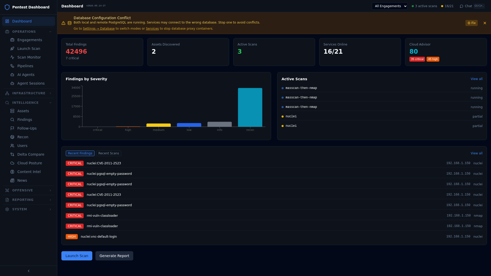

# RAG Scan Stack

An open-source **workflow collector for authorized penetration testing and red team engagements**. It runs your security tools, normalizes their wildly different outputs into one engagement-scoped finding model, deduplicates and tracks findings across runs, manages forward scanning infrastructure (WireGuard, SSH tunnels, SOCKS chains, cloud nodes with IP rotation), pushes results straight into Burp Suite, and audits every scan, agent decision, and node action on an OPSEC timeline.

> **Authorized testing only.** This tool is built for engagements you have written permission to perform. Read [Authorized use](#authorized-use) before running it.



*The main dashboard — engagement-scoped totals, findings-by-severity, live scans, and the most recent findings across every tool.*

---

## Why it exists

A pentester or red teamer typically juggles **30+ command-line tools**, each with its own output format, spread across multiple terminals and engagements. Findings get stranded in text files, deduplication is manual, cross-referencing CVEs is tedious, and getting data into Burp or a report takes hours. The time spent wrangling tools is time *not* spent finding vulnerabilities.

The usual workflow looks like this:

```
Run nmap   → parse XML  → copy into a spreadsheet
Run nuclei → parse JSON → cross-reference CVEs by hand
Run ZAP    → export     → manually merge with the nmap findings
Open Burp  → can't import any of the above
Write report → re-type everything into the template
```

RAG Scan Stack collapses that into a single platform that **launches the tools, normalizes all the output into one database, deduplicates across tools and runs, and feeds the result directly into manual testing workflows** — with engagement scope, audit trails, and OPSEC alerts built in so that authorized-only operation is the path of least resistance.

It is a **collection and workflow tool, not an attack platform.** Its job is to organize the evidence so a human tester can do the actual testing faster and with full context.

---

## What it does

### Collect — one interface for 30+ tools

Launch any scan from the dashboard — no terminal, no flag memorization. Tools are grouped by phase and run locally or, more commonly, on a remote node over an SSH/SOCKS tunnel.

| Category | Representative tools |
|---|---|
| Port / service | Nmap, Masscan, Naabu |
| Web app | ZAP, Nuclei, Nikto, Katana, Gobuster, ffuf, Playwright |
| Recon / OSINT | Subfinder, Amass, httpx, dnsx, WhatWeb, GoWitness, crt.sh, gau, Censys |
| TLS / SSH audit | sslscan, testssl, sslyze, ssh-audit, tlsx, wafw00f |
| Credentials | Brutus (brute-force), Hashcat |
| Cloud | Prowler, ScoutSuite, CloudFox, Pacu, AzureHound, MicroBurst |
| Internal / AD | NetExec, Impacket |
| Secrets / content | TruffleHog, Swagger/OpenAPI discovery |

Smart Recon recommends the right tool + command for a given service/port from a built-in knowledge base; Pipelines chain multiple tools into one launch (recon pipeline, full web scan, etc.).

### Normalize — one finding model

Every tool's output is parsed by a dedicated, pluggable ETL module (**38 parsers**) into a single normalized schema covering:

- **Target identity** — asset, hostname, IP, tags, environment
- **Service identity** — port, protocol, banner, TLS info
- **Finding identity** — tool, rule/template id, title, severity, confidence, evidence, timestamps
- **References** — CVE, CWE, URLs
- **Provenance** — run id, tool version, sanitized command line, parser version

Unknown tools fall back to structured text extraction (JSON, tables, CVEs, key/value pairs) so nothing is lost. Finding **sources are attributed correctly** — ssh-audit findings show as `ssh-audit`, sslscan as `sslscan`, never lumped under nmap.

### Deduplicate + delta — nothing lost, nothing double-counted

- **Stable fingerprinting** dedups the same vulnerability found by multiple tools or across multiple runs into one finding.
- **First seen / last seen** tracking on every finding.
- **Delta view** between two runs of the same scope: what's new, what's resolved, what changed severity or evidence.

### Triage — focus on the real issues

A detection-rules engine raises **Follow-Ups** for items needing human attention — vulnerable software versions with known CVEs, expired/self-signed TLS, login pages with no WAF, exposed API endpoints, open redirects. Software versions are cross-referenced against the CVE database and **ExploitDB** (searchsploit). Dismiss a false positive once and the system skips similar findings next time.

### Hand off — into the tools testers actually use

- **Burp Suite** — the bundled Jython extension (`burp-extension/RagScanBridge.py`) pulls findings (filtered by scope, engagement, host, severity, or tool) into *Target > Issues* with **real HTTP request/response pairs**, not synthetic ones. Preview the count before importing.
- **Proxy replay** — push discovered URLs, parameters, and payloads through Burp/ZAP so the sitemap is pre-populated.
- **HAR** — standard import into Burp or ZAP.
- **SARIF** — for AppSec / CI hand-off.
- **JSON + CSV** — deterministic, documented exports for reporting and ticketing.

### Operate safely — scope, OPSEC, infrastructure

- **Engagement + scope model** — group everything under an engagement; the top-bar selector filters all pages. In-scope IPs are auto-included even if scanned before the engagement existed.
- **Forward infrastructure** — WireGuard peers auto-provisioned per node, DigitalOcean and AWS droplet provisioning with reserved-IP rotation, SOCKS chaining via the tunnel manager, and **profile-based proxy routing (pentest vs. redteam)**. Tunnels self-heal — a dropped tunnel reconnects within ~4 minutes.
- **OPSEC timeline + alerts** — every scanner dispatch, node action, and agent decision is a timeline entry. Alerts fire on out-of-scope target attempts, anomalous scan rates, and any agent recommendation that breaches the engagement boundary.
- **Webhooks** — every action emits an event (`POST /webhooks/emit`) so Slack, n8n, or a SIEM can subscribe in real time.
- **TLS everywhere** — internal service traffic is encrypted; the dashboard is HTTPS by default.

### (Optional) RAG-grounded AI agents — off by default

LLM agents grounded in *your engagement's own findings* via RAG over **pgvector** — not generic CVE prose. Used for scan recommendation and analysis. Every recommendation is a reviewable timeline entry; every action is auditable. Runs against a local LLM (Ollama) so engagement data never leaves the host.

---

## Quickstart

Requires Docker + Docker Compose, GNU make, and ~20 GB free disk for images and indexes. 16 GB RAM minimum (32 GB recommended; GPU optional, only for the AI agents).

```sh
git clone https://github.com/fd22vrsfpv-star/rag-scan-stack.git
cd rag-scan-stack
make setup          # one-time: generates secrets, certs, env file, db-config.json
make up             # builds and starts the stack (local Postgres by default)
```

The dashboard comes up at **https://localhost:3002** (self-signed cert on first boot). Then:

```sh
make db-status      # verify the database is healthy
docker compose ps   # check container health
make down           # stop the stack
make clean          # reset everything (destroys local DB data)
```

**First run, in the UI:** create an engagement → define scope under *Settings → Scope* → connect a scan node under *Nodes → SSH Tunnels* (or provision a cloud node) → launch a recon scan or pipeline from *Scan Launcher* → triage under *Findings* → export from *Reports*. See [`Docs/START_HERE.md`](Docs/START_HERE.md) for the full walkthrough.

---

## How the data flows

```
                 ┌─────────────┐
  Scan Launcher  │  30+ tools  │  run locally or on a remote node (SSH/SOCKS tunnel,
  / Smart Recon  │  + pipelines│  WireGuard, profile-based proxy: pentest | redteam)
  / Pipelines    └──────┬──────┘
                        │ raw output (XML / JSON / text)
                 ┌──────▼──────┐
                 │ 38 ETL      │  normalize → fingerprint → dedup → scope-gate
                 │ parsers     │
                 └──────┬──────┘
                 ┌──────▼───────────────┐
                 │ PostgreSQL + pgvector │  one finding model · first/last seen ·
                 │ (engagement-scoped)   │  provenance · RAG index
                 └──────┬───────────────┘
        ┌───────────────┼───────────────────────┐
   ┌────▼────┐    ┌──────▼──────┐         ┌───────▼────────┐
   │ Dashboard│   │ Exports     │         │ OPSEC timeline │
   │ (triage, │   │ Burp · HAR  │         │ + webhooks     │
   │ delta,   │   │ SARIF · CSV │         │ + alerts       │
   │ assets)  │   │ JSON        │         └────────────────┘
   └──────────┘   └─────────────┘
```

---

## Components

| Service / dir | Purpose |
|---|---|
| `dashboard/` | React frontend + FastAPI BFF. Engagements, scope, findings, assets, OPSEC timeline, settings, service health. |
| `app/rag-api/` | Core API — assets, findings, scans, exports, recon, RAG retrieval over pgvector. |
| `etl/` | 38 pluggable parsers + normalization, fingerprinting, and scope-gating pipelines. |
| `node_manager/` | Provisions and tracks remote nodes (DO/AWS), WireGuard peers, SSH tunnels, SOCKS chains. |
| `tunnel-manager/` | Native Go service for tunnel lifecycle, port allocation, profile-based proxy routing. |
| `nmap_scanner/`, `nuclei/`, `osint_runner/`, `pd_runner/`, `playwright_scanner/`, `web_scanner/`, `brutus_runner/`, `news_runner/` | Tool-specific scanner runners — each a parser + executor + audit emitter. |
| `exploit_runner/` | Optional headless Metasploit / web-PoC runner for cleared exploitation steps. |
| `autogen_agents/`, `scan_recommender/` | Optional LLM agents and RAG-grounded scan recommendation. |
| `burp-extension/` | Jython extension that ingests findings into Burp Issues (with real request/response). |
| `db_init/` | Postgres schema (`ensure_all_tables.sql`) + verification (`ensure_db_schema.sh`). |
| `knowledge/` | Scope rules and playbook content used by the recommender's RAG retrieval. |
| `mcp/` | MCP tool servers exposing stack capabilities to LLM clients. |

The dashboard surfaces this through ~40 pages including Scan Launcher, Findings Explorer, Asset Browser, Attack Map, Target Board, Delta Compare, Follow-Ups, Recommendations, Engagements, Reports, Nodes, OPSEC, Cloud Posture, Knowledge Base, and Services/Diagnostics.

### Deployment modes

The database can run **local** (default), **remote over an SSH tunnel**, or **remote direct over SSL**, switched from *Settings → Database* and persisted in `db-config.json`. Compose overlays exist for macOS (`docker-compose.mac.yml`), remote DB (`docker-compose.remote-db.yml`), VPN/WireGuard (`docker-compose.vpn.yml`), Azure, and logging. See [`Docs/REMOTE-DB-SETUP.md`](Docs/REMOTE-DB-SETUP.md) and [`Docs/DEPLOYMENT.md`](Docs/DEPLOYMENT.md).

---

## Documentation

- [`Docs/START_HERE.md`](Docs/START_HERE.md) — getting started + common workflows (external / internal / web app)
- [`Docs/EXECUTIVE_OVERVIEW.md`](Docs/EXECUTIVE_OVERVIEW.md) — capabilities and positioning
- [`Docs/DATABASE_SCHEMA.md`](Docs/DATABASE_SCHEMA.md) — the normalized data model
- [`Docs/API_ENDPOINTS.md`](Docs/API_ENDPOINTS.md) / [`Docs/RAG_STACK_API_REFERENCE.md`](Docs/RAG_STACK_API_REFERENCE.md) — API reference
- [`Docs/DEPLOYMENT.md`](Docs/DEPLOYMENT.md), [`Docs/QUICKSTART-MACOS.md`](Docs/QUICKSTART-MACOS.md), [`Docs/QUICKSTART-WINDOWS.md`](Docs/QUICKSTART-WINDOWS.md) — deployment guides
- [`Docs/HEALTH_CHECK_GUIDE.md`](Docs/HEALTH_CHECK_GUIDE.md) — health checks and diagnostics

### Illustrated guides (PDF)

Walkthroughs with annotated screenshots of the dashboard. Click to view in GitHub's PDF reader or download.

- [Complete Guide](presentation-materials/pdfs-clean/RAG-Scan-Stack-Complete-Guide-NO-INSTRUCTIONS.pdf) — the full platform tour: features, operations, and architecture in one document.
- [User Guide & Features](presentation-materials/pdfs-clean/01-User-Guide-Features-CLEAN.pdf) — every page of the dashboard and what it does, for testers.
- [Management & Health](presentation-materials/pdfs-clean/02-Management-Health-CLEAN.pdf) — operations, monitoring, service health, and administrative tasks.
- [Architecture](presentation-materials/pdfs-clean/03-Architecture-Simple-CLEAN.pdf) — how the services fit together.

---

## Authorized use

This is a workflow tool for security testing engagements you have **written authorization** to perform. It is *not* an attack platform, and it ships with engagement scope enforcement, audit trails, and OPSEC alerts intended to make authorized-only operation the path of least resistance.

Operators are expected to:

- Run only against assets covered by a written engagement scope.
- Keep engagement isolation enforced — never reuse credentials, findings, or scope data across engagements without explicit authorization.
- Treat the audit trail as discoverable and reportable to the engagement owner.

The maintainers do not condone or support unauthorized use.

---

## Security disclosure

If you find a vulnerability in this stack itself (not a finding it surfaced about a target), please open a private security advisory via GitHub's *Security* tab on this repository, or email `fd22vrsfpv-star@privaterelay.appleid.com`. Please do not file public issues for security problems.

---

## Contributing

Contributions welcome — bug reports, parsers for new tools, scanner integrations, exporters, OPSEC alert rules. Open an issue first for anything non-trivial so we can talk about scope before code is written.

---

## License

[Apache License 2.0](LICENSE). Copyright the project contributors.
